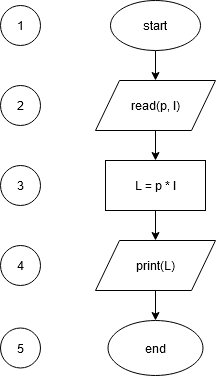

## Algorithm Representation

Bentuk penyajian algoritma pada umumnya dilakukan dengan dua cara, yaitu
dengan menggunakan Diagram Alur (*Flowchart*) dan *Pseudocode*. Hal ini
bertujuan untuk mempermudah pembaca untuk memahami bagaimana langkah-langkah
sebuah algoritma berjalan.

##### Diagram Alur (Flowchart)
Diagram Alur (*Flowchart*) adalah gambar, bagan atau simbol yang memperlihatkan urutan dan hubungan antar proses beserta pernyataannya. Gambar pada Diagram Alur 
berupa bangun datar yang masing-masing memiliki arti tersendiri.


Contoh diagram alur untuk menghitung luas dari sebuah persegi panjang. 



Pada contoh diatas terlihat beberapa langkah proses:
1. Simbol pertama merupakan simbol yang menunjukkan dimulainya suatu program (*start*).
2. Simbol kedua merupakan simbol *input/output* (**I/O**), terdapat pernyataan
**read(p, l)**, artinya program menerima *input* dari user (*read*).
3. Simbol ketiga merupakan simbol untuk mengeksekusi suatu proses. Pada gambar
diatas proses yang akan dieksekusi adalah melakukan perkalian variabel **p**
dengan variabel **l** kemudian menyimpan hasilnya dalam variabel **L**. 
4. Simbol keempat merupakan simbol *input/output* (**I/O**), yang dimana terdapat
pernyataan **print(L)**, artinya program akan menampilkan *output* dari hasil
eksekusi proses dari program.
5. Simbol kelima merupakan simbol yang menunjukkan terminasi dari program.

Simbol memulai dan mengakhiri suatu program adalah sama yaitu oval, dan simbol
jajar genjang adalah simbol yang memiliki arti *input/output*.

##### Pseudocode

Pseudocode adalah suatu bentuk representasi algoritma atau alur dari suatu program,
dengan menggunakan bahasa yang memiliki kemiripan dengan bahasa pemogramman secara
struktural. Pada umumnya, pseudocode menggunakan konvensi yang digunakan pada bahasa pemrogramman.

Secara umum, struktur penulisan pseudocode adalah sebagai berikut:

```
---------------------------------------------------------------------------------

[PROGRAM || PROCEDURE || FUNCTION] [nama_program || nama_prosedur || nama_fungsi]
{deskripsi dari program || prosedur || fungsi}

DECLARATION
{berisi variabel yang akan digunakan dalam program || prosedur || fungsi dengan
tipe data tertentu.}

ALGORITHM
{berisi proses-proses dari suatu program || prosedur || fungsi}

---------------------------------------------------------------------------------

nb: simbol || memiliki arti atau.
```

Contoh Pseudocode untuk melakukan menghitung luas dari sebuah persegi panjang. 

```
---------------------------------------------------------------------------------

PROGRAM luas_persegi_panjang
{program untuk menghitung luas persegi panjang, dengan besar panjang dan lebar
merupakan inputan dari user, dan program akan menampilkan luas dari persegi panjang}

DECLARATION
  p, l, L: real

ALGORITHM
  read(p, l)
  L <- p * l
  write(L)

---------------------------------------------------------------------------------

nb:
- read artinya menerima inputan user
- write artinya menampilkan hasil program
- simbol <- artinya sama dengan.
```


Contribute by: [Jayaku Briliantio](https://www.linkedin.com/in/neartojayakubriliantio)
